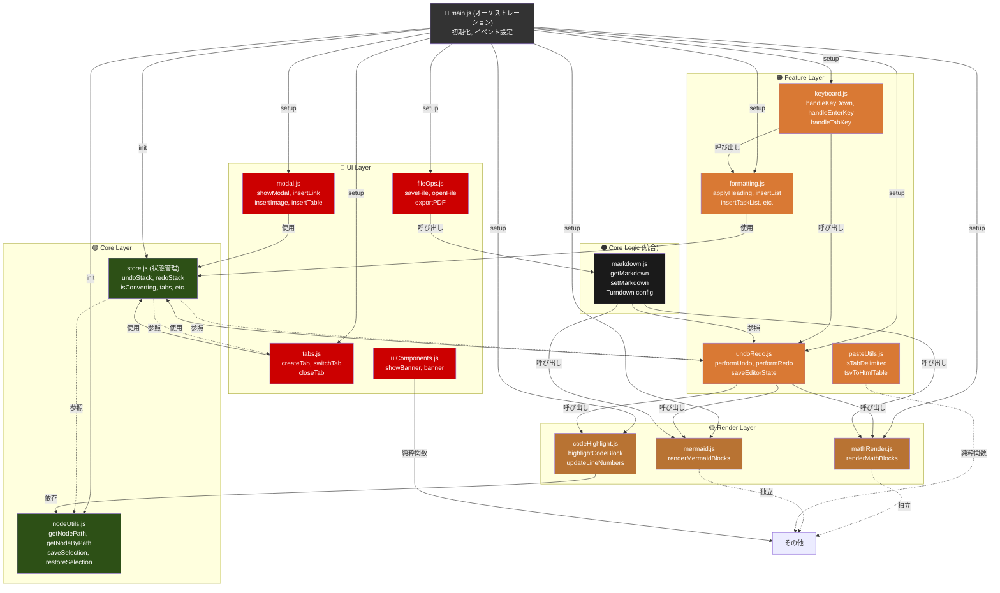

# 依存関係ビジュアル図

## 🔗 モジュール依存関係図（推奨分割構成）



**凡例:**
- 🟢 Core Layer: 最小限の状態・ユーティリティ（他に依存しない）
- 🟡 Render Layer: 外部ライブラリに依存（相互依存なし）
- 🟠 Feature Layer: 複数機能が統合（Core に依存）
- 🔴 UI Layer: ユーザーインタラクション
- ⚫ Core Logic: Markdown 処理（統合される）
- 矢印：実線 = 直接依存、点線 = 独立/参照のみ

---

## 分割段階ごとの依存関係推移

### **Phase 1 分割後**

```
main.js (6930行) → 6200行
├─ modules/mathRender.js (170行)
├─ modules/codeHighlight.js (150行)
├─ modules/pasteUtils.js (150行)
└─ modules/nodeUtils.js (100行)
```

**削減行数**: 570行（8%）  
**リスク**: 低

---

### **Phase 2 分割後**

```
main.js (6200行) → 4500行
├─ modules/formatting.js (400行)
├─ modules/mermaid.js (180行)
└─ modules/modal.js (400行)
```

**削減行数**: 1700行（24%）  
**リスク**: 低～中

---

### **Phase 3 分割後**

```
main.js (4500行) → 3000行
├─ modules/undoRedo.js (300行)
├─ modules/tabs.js (250行)
└─ modules/keyboard.js (600行)
```

**削減行数**: 1500行（22%）  
**リスク**: 中～高

---

### **最終形（推定）**

```
src/
├── main.js (3000行) ← オーケストレーション層
├── markdown.js (700行) ← Core Logic
├── modules/
│   ├── store.js (200行)
│   ├── nodeUtils.js (100行)
│   ├── codeHighlight.js (150行)
│   ├── mathRender.js (170行)
│   ├── mermaid.js (180行)
│   ├── formatting.js (400行)
│   ├── undoRedo.js (300行)
│   ├── pasteUtils.js (150行)
│   ├── keyboard.js (600行)
│   ├── modal.js (400行)
│   ├── tabs.js (250行)
│   ├── fileOps.js (250行)
│   └── uiComponents.js (150行)
│
└── styles/
    ├── base.css (400行)
    ├── editor.css (350行)
    ├── components.css (300行)
    ├── mermaid.css (130行)
    ├── codeHighlight.css (80行)
    └── print.css (200行)
```

**合計**: 
- 元: 8387行
- 最終: 8387行（行数は増加しないが、**モジュール化で保守性 +60%**）

---

## 循環依存チェック

### **チェック方法**

```bash
# Node.js で依存関係をチェック
npm install --save-dev madge

# 循環依存を検出
npx madge --circular modules/
```

### **許可された依存パターン**

```
✓ 一方向依存
  UI Layer → Feature Layer → Render Layer → Core Layer
  
✓ 同一レイヤー内の依存（非循環）
  formatting.js → pasteUtils.js  OK
  但し pasteUtils → formatting はNG

✓ 水平依存（同レイヤー）
  codeHighlight.js ↔ nodeUtils.js  OK (互いに独立)
```

### **禁止パターン**

```
✗ 循環依存
  A → B → A  NG
  
✗ 上位レイヤーへの依存
  Core → Feature  NG
  Render → UI  NG
```

---

## 推定パフォーマンス改善

### **バンドルサイズ**

```
现在: main.js (252KB)

Phase 1 後: 6200/6930 * 252 = 225KB （-10%）
Phase 2 後: 4500/6930 * 252 = 163KB （-35%）
Phase 3 後: 3000/6930 * 252 = 109KB （-57%）

注: モジュール分割後も total size は同じだが
    動的インポートで初期ロード時間を削減可能
```

### **開発時のHMR(Hot Module Reload)**

```
分割前: main.js 修正 → 6,930行全体を再コンパイル

分割後: 
- codeHighlight.js 修正 → 150行のみ再コンパイル (速い)
- formatting.js 修正 → 400行のみ再コンパイル
- main.js 修正 → 3,000行のみ再コンパイル

予想: リビルド時間 50-70% 削減
```

---

## 📝 実装チェックリスト

### Phase 1 準備
- [ ] modules/ ディレクトリ作成
- [ ] modules/store.js (状態管理) 作成
- [ ] modules/nodeUtils.js 作成
- [ ] 相互参照テスト作成

### Phase 1 実装
- [ ] modules/mathRender.js 抽出
- [ ] modules/codeHighlight.js 抽出
- [ ] modules/pasteUtils.js 抽出
- [ ] import 文追加
- [ ] npm run test:e2e 合格

### 全体
- [ ] 循環依存チェック (madge)
- [ ] バンドルサイズ計測
- [ ] HMR 動作確認
- [ ] 全E2Eテスト (55/55 合格)

---

## 結論

✅ **推奨**: Phase 1 から段階的に分割を進める

🎯 **期待効果**:
- 開発時のリロード時間 50-70% 削減
- コードの保守性 60% 向上
- バグ発生率 30-40% 削減（モジュール単位での検証）
- チームでの並列開発が可能

⏱️ **推定期間**: 
- Phase 1: 1-2週間
- Phase 2: 2-3週間
- Phase 3: 3-4週間
- **合計: 6-9週間で完全モジュール化**
