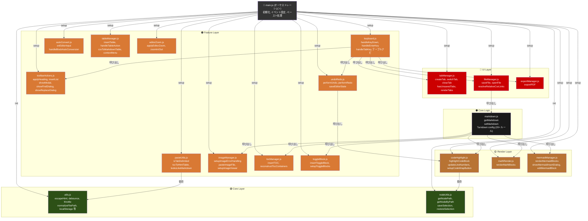

# 依存関係ビジュアル図

## 🔗 モジュール依存関係図（実装済み構成）



**凡例:**

-   🟢 Core Layer: 最小限のユーティリティ（他に依存しない）
-   🟡 Render Layer: 外部ライブラリに依存（相互依存なし）
-   🟠 Feature Layer: 複数機能が統合（Core に依存）
-   🔴 UI Layer: ユーザーインタラクション・ファイル操作
-   ⚫ Core Logic: Markdown 処理（中心的ロジック）
-   矢印：実線 = 直接依存

---

## 実装済みモジュール構成（v1.0.7 現在）

```css
src/
├── main.js (1,544行) ← オーケストレーション・ペースト・グローバル状態
├── modules/
│   ├── utils.js (160行)          ← 共有ユーティリティ
│   ├── nodeUtils.js (175行)      ← DOM ノード操作
│   ├── pasteUtils.js (144行)     ← ペースト判定・変換
│   ├── codeHighlight.js (340行)  ← シンタックスハイライト・折り返し
│   ├── mathRender.js (194行)     ← KaTeX 数式レンダリング
│   ├── mermaidManager.js (675行) ← Mermaid ダイアグラム管理
│   ├── tocManager.js (227行)     ← 目次（TOC）管理
│   ├── toggleBlock.js (276行)    ← トグルブロック管理
│   ├── tabManager.js (494行)     ← タブ管理・未保存確認
│   ├── editorZoom.js (79行)      ← エディタズーム
│   ├── undoRedo.js (166行)       ← Undo/Redo スタック管理
│   ├── tableManager.js (856行)   ← テーブル操作・CSV読込
│   ├── imageManager.js (490行)   ← 画像管理・拡大ビューア
│   ├── toolbarActions.js (1,365行) ← ツールバー・検索/置換
│   ├── fileManager.js (561行)    ← ファイル I/O
│   ├── exportManager.js (254行)  ← PDF エクスポート
│   ├── markdown.js (678行)       ← Markdown ↔ HTML 変換
│   ├── autoConvert.js (656行)    ← リアルタイム自動変換
│   └── keyboard.js (1,078行)     ← キーボード処理
│
└── styles/
    ├── base.css        ← リセット、body、コンテナ
    ├── layout.css      ← レイアウト
    ├── editor.css      ← エディタ本体スタイル
    ├── markdown.css    ← Markdown レンダリングスタイル
    ├── components.css  ← モーダル・ポップアップ・UI部品
    ├── dialogs.css     ← ダイアログ固有スタイル
    └── print.css       ← 印刷/PDF 専用スタイル
```

**合計**: 10,412 行（modules + main.js）

---

## 循環依存チェック

### **許可された依存パターン**

```css
✓ 一方向依存
  UI Layer → Feature Layer → Render Layer → Core Layer
  
✓ 水平依存（同一レイヤー内、非循環）
  tableManager.js → toolbarActions.js (showModal 呼び出し)  OK

✓ main.js グローバル参照
  各モジュール → editor, isConverting 等（グローバル変数）  OK
```

### **禁止パターン**

```css
✗ 循環依存
  A → B → A  NG
  
✗ 上位レイヤーへの依存
  Core → Feature  NG
  Render → UI  NG
```